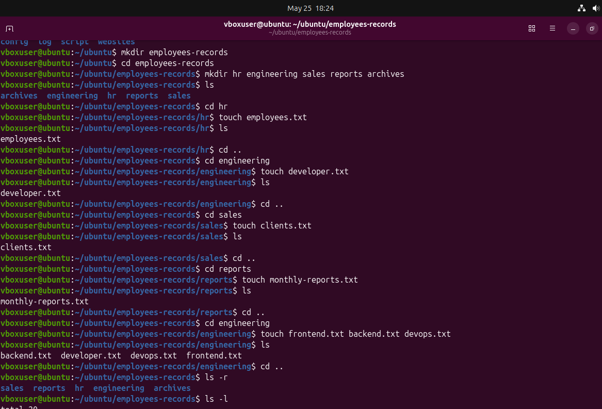

 Employee Records Management Scenario
📌 Scenario

Worked on a Linux Administrator practice scenario where I organized company employee records using basic Linux commands.

The task included:

    Creating project directories
    Managing employee files
    Copying and moving reports
    Renaming files
    Working with hidden files
    Cleaning unnecessary data

📂 Project Structure

employee-records/
├── hr/
├── engineering/
├── sales/
├── reports/
└── archive/

## Screenshot

