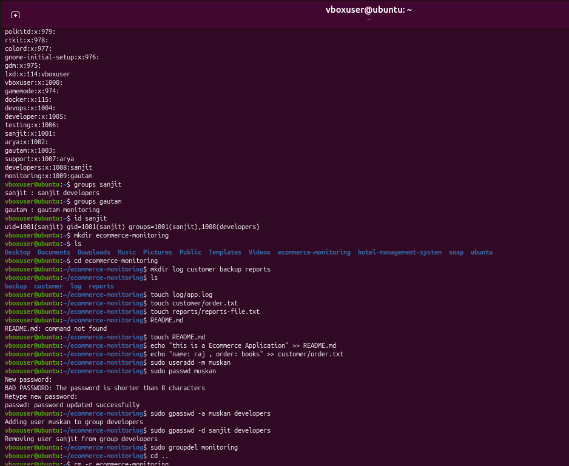

# 🛒 E-Commerce Monitoring System — Linux Practice

## 📌 Scenario

Worked on a Linux Support Engineer practice scenario for managing e-commerce application logs and customer data on a Linux server.

## 🛠 Tasks Performed

* Created users and groups
* Managed folders and files
* Added data using `echo`
* Read file contents using `cat`
* Checked group membership
* Copied and moved files
* Deleted unnecessary files and directories

## 💻 Commands Practiced

`useradd` `groupadd` `usermod` `groups` `mkdir` `touch` `echo` `cat` `cp` `mv` `rm`

## 📂 Project Structure

```bash
ecommerce-monitoring/
├── logs/
├── customers/
├── reports/
└── backup/
```

## 📸 Practice Screenshot

```md

```


